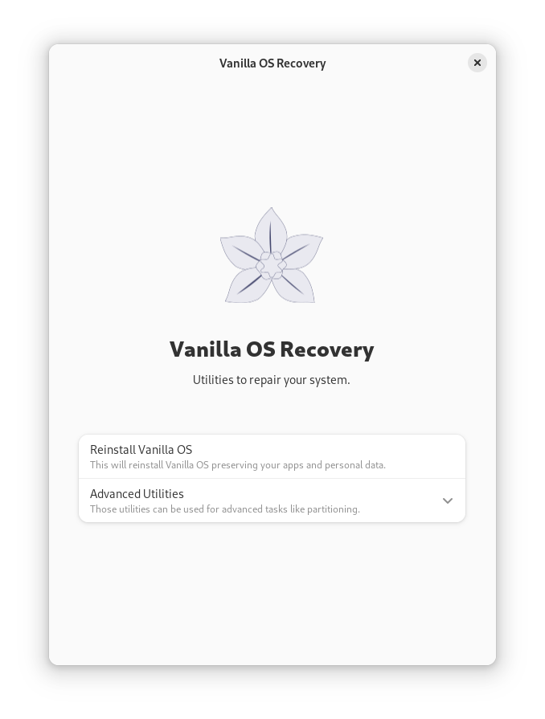

<div align="center">
    
    <h1>Vanilla Recovery Utility</h1>
</div>

<div align="center">

[![Translation Status][weblate-image]][weblate-url]

[weblate-url]: https://hosted.weblate.org/engage/vanilla-os/

<p>Utility to recover the system to its original state.</p>
<br />

</div>

## Build
### Dependencies
- build-essential
- meson
- libadwaita-1-dev
- gettext
- abroot-recovery

### Build
```bash
meson build
ninja -C build
```

### Install
```bash
sudo ninja -C build install
```

## Run
```bash
vanilla-recovery-utility
```
